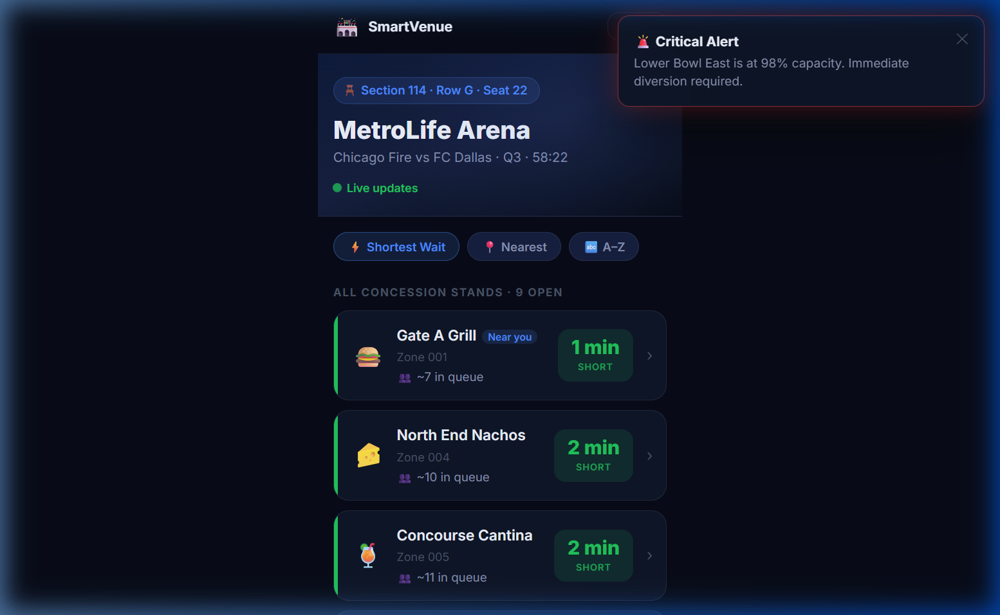
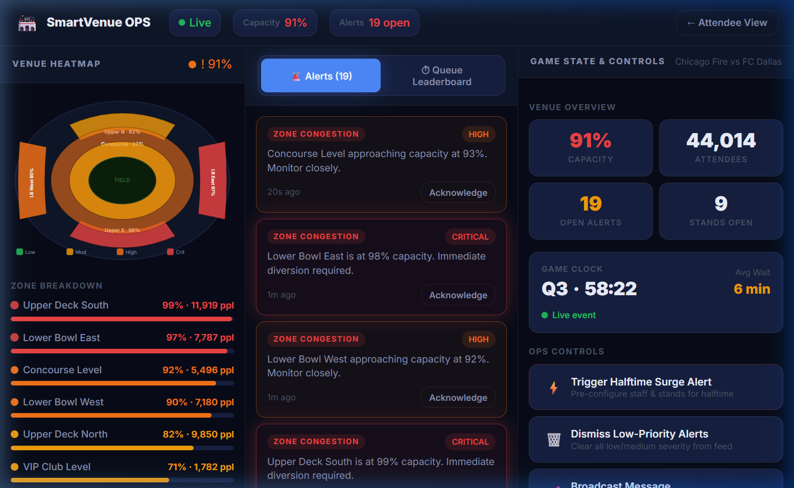

Live Link: https://smart-venue-364397114547.us-central1.run.app/

# 🏟️ Smart Venue App

A sophisticated, full-stack web application designed to improve the event experience at large-scale sporting venues through real-time crowd density monitoring, concession wait times, and mobile ordering.

This project contains a unified prototype linking a Node.js/Express backend (that simulates a real venue's sensors) to a Vite/React frontend that serves two distinct products:
1. **Attendee Mobile Web App** for stadium guests
2. **Ops Staff Dashboard** for venue operations

---

## 📸 Screenshots

### Attendee Mobile App
A simple, mobile-first web app designed for one-handed use in a crowded environment. Users can see live concession wait times, check stand menus, and order food directly to their seat.


### Ops Staff Dashboard
A dense, desktop-first command center for venue operations. Staff can monitor live zone capacities, track alerts, trigger surge procedures, and view which stands are the busiest.


---

## ✨ Features

### Attendee Features
- **Live Concession Wait Times**: Accurate wait times that pulse whenever new crowd data arrives.
- **Nearest Sorting**: Find the fastest or closest food options near your specific seat.
- **Seat-Side Delivery Ordering**: View full menus, assemble a cart, and place a mock order.
- **Real-Time Order Tracking**: Multi-stage progress tracker from "Confirmed" to "Delivering".

### Operational Features
- **Venue Heatmap**: An interactive SVG visualization showing real-time crowd density across all venue zones.
- **Automated Alerts**: The backend automatically generates warnings and critical alerts when zones cross capacity thresholds.
- **Queue Leaderboard**: Ranks open concession stands by wait time and indicates trend direction (↑ or ↓).
- **Surge Prediction Controls**: Ops staff can trigger a "Halftime Surge" to simulate mass movement and adjust operations instantly.

---

## 🛠️ Technology Stack

- **Frontend**: React 18, Vite, React Router
- **Global State**: Zustand (atomic, performant)
- **Styling**: Modern Vanilla CSS, CSS Variables, Flexbox/Grid
- **Backend**: Node.js, Express (Simulated TimescaleDB & Redis queues)
- **Real-Time Layer**: Server-Sent Events (SSE) for one-way live dashboard and app updates

---

## 🚀 Getting Started

### Prerequisites
- Node.js (v16+ recommended)
- npm

### Installation
Clone the repository and install dependencies:

```bash
cd promptwars1
npm install
```

### Running Locally
To launch both the API backend and the React frontend simultaneously:

```bash
npm run dev
```

The application uses `concurrently` to run both servers:
- **Backend API:** `http://localhost:3001`
- **Frontend App:** `http://localhost:5173`

*(Note: API requests from the frontend are seamlessly proxied to the backend via Vite's `server.proxy` configuration.)*

---

## 📁 Project Structure

```
promptwars1/
│── package.json          # Concurrently scripts & dependencies
│── server.js             # Express API, SSE endpoints & sensor simulation
│── vite.config.js        # Vite config connecting frontend to backend
│── index.html            # Core HTML template
├── docs/                 # Documentation and screenshots
└── src/
    ├── main.jsx          # React app entry point
    ├── App.jsx           # Routing and global SSE Provider
    ├── store.js          # Zustand global state management
    ├── index.css         # Custom Design System
    ├── utils.js          # Helpers, formatters, and logic mappings
    ├── components/
    │   └── UI.jsx        # Shared components (Badges, Toasts, Stepper, Skeletons)
    └── pages/
        ├── AttendeeApp.jsx   # Mobile Attendee Web App
        └── OpsDashboard.jsx  # Desktop Operations Dashboard
```

---

*Designed for high-traffic environments, ensuring minimal time-to-interactive and clear visibility for both sports fans and operations managers.*
